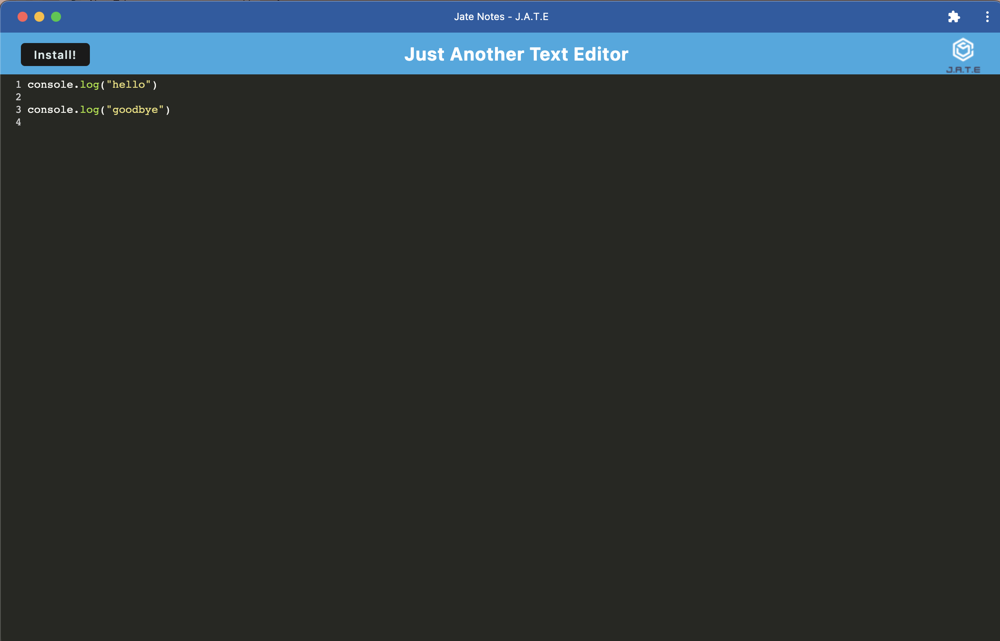

# Text Editor

## Description.

This week's challenge is to build a text editor that runs in the browser. The app will be a single-page application using Progressive Web Applications (PWA) criteria. 

[Link to deployed application on Heroku](https://linh-text-editor.herokuapp.com/)

[Link to GitHub respository](https://github.com/linhntran/pwa-text-editor.git)

Below is a preview of the application when viewing the deployed link. 

## Credits

The application's front end was cloned from the Bootcamp's starer code. 

## License
  
 [Open Source Initiative Link](https://opensource.org/licenses/MIT)
